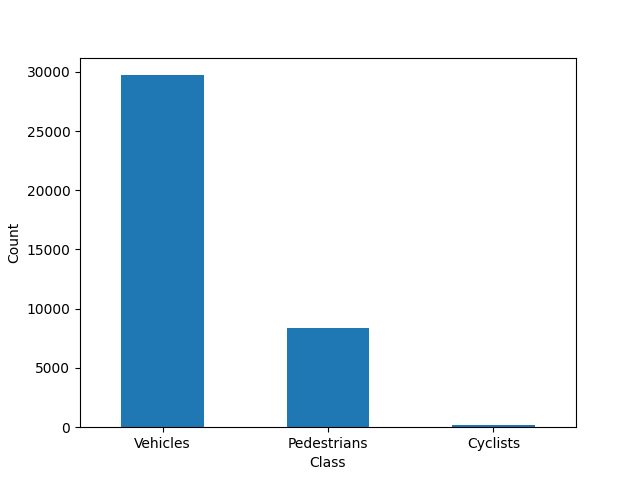
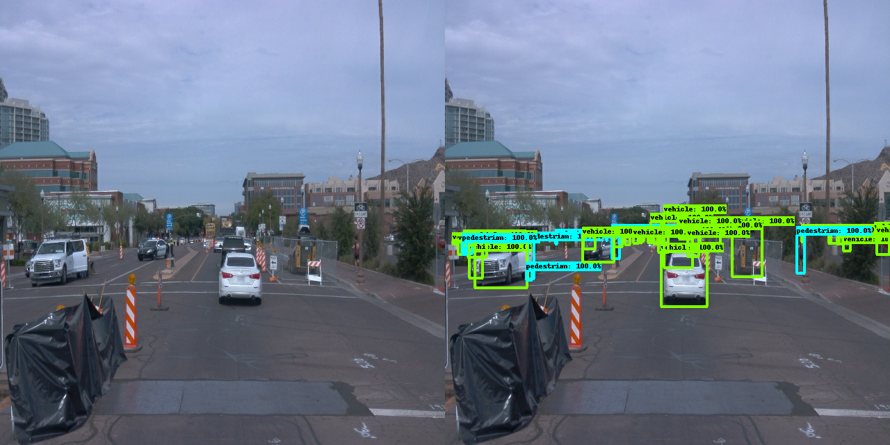
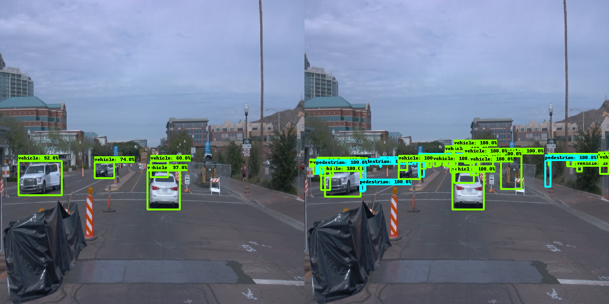

# Object Detection in an Urban Environment

## Project overview

Goal of the project is, to apply the skills gained in the computer vision course, which is part of the Self Driving Car Engineer Nanodegree program. Object detection is useful in autonomous vehicle as camera are relatively cheap sensor with a high resolution, which allows detection of multiple object of different sizes.
A convolutional neural network will be used to detect and classify objects originating from [Waymo Open dataset](https://waymo.com/open/). Specifically, the classes of object shall be detected in image taken by the front camera of a vehicle: cyclists, pedestrians and vehicles.

In the first step, an exploratory data analysis will be performed to gain some knowledge about the data set. Then a pretrained Resnet50 model will be trained on the training data, validated and hyperparameters tuned if needed.

## Structure

### Data

The data files can be downloaded directly from the Waymo website as tar files or from the [Google Cloud Bucket](https://console.cloud.google.com/storage/browser/waymo_open_dataset_v_1_2_0_individual_files/) as individual tf records.
The Udacity project workspace has been used for the project. The workspace has the data already readily available.

The data in the workspace was already partitioned into 3 splits:<br>
/home/workspace/home/data/train - 86 files<br>
/home/workspace/home/data/val - 10 files<br>
/home/workspace/home/data/test - 3 files<br>


### Experiments
The experiments folder will be organized as follow:
```
experiments/
    - pretrained_model/
    - exporter_main_v2.py - to create an inference model
    - model_main_tf2.py - to launch training
    - reference/ - reference training with the unchanged config file
    - experiment1 .. 4/ - experiments with different parameters
    - final/ - final training of the model
    - label_map.pbtxt
```

## Prerequisites

Workspace has been used as provided, no changes where made. Udacity provided information about the requirements for running the scripts on a machine other than the workspace, those infos can be found in folder "build".

## Exploratory Data Analysis
### Preview of images
The following images are randomly picked from the data set. The image title is the brightness of the image, the intention is to get an idea how the brightness value maps to an image so the histogram in the following analysis can be interpreted.<br>
Object classes of the bounding boxes are color coded:
|Object class|Color|
|------------|-------|
|Vehicles|red|
|Pedestrian|green|
|Cyclists|blue|

||||
|:-------------------------:|:-------------------------:|:-------------------------:|
||||
||||

### Plan for further data analysis
The training and validation data set shall be compared.<br> 
The following stats shall be calculated for every frame in the datasets:
- Number of objects
- Number of vehicles
- Number of pedestrians
- Number of cyclist
- Brightness of image

### Histograms
#### Number of objects

#### Number of vehicles

#### Number of pedestrians

#### Number of cyclist

#### Brightness of image

### Object number per class in training data

### EDA Summary
The training data set contains 1719 and the validation data set 198 individual pictures. According to the histogram plot as well as to the median in the descriptive statistics, the validation data set generally contains more objects per frame compared with the training data set.
In both data set, there are almost no cyclists. Most of the objects are vehicles.
The average image brightness is quite comparable in both data sets, though the validation set does not contain really dim images.
In the training data set, the proportions of the object number per class is quite different. The majority of ground truth objects in the training data are vehicles (29710), there are less pedestrians (8355) and only a few cyclists (214). According to this (machine learning course)[https://developers.google.com/machine-learning/data-prep/construct/sampling-splitting/imbalanced-data?hl=en], the dataset is extremely imbalanced and special attention is needed when training the model. Thanks to the reviewer for pointing that important topic out.

## Training and evaluation of the object detection algorithm
### Reference experiment
A reference experiment has been provided which has been used as a baseline for further experiments. More information on the 'Single Shot Detector' can be found here [here](https://arxiv.org/pdf/1512.02325.pdf).<br>
The reference uses a pretrained SSD Resnet 50 640x640 model, which was also used for all further experiments.<br>
Step1: Download the [pretrained model](http://download.tensorflow.org/models/object_detection/tf2/20200711/ssd_resnet50_v1_fpn_640x640_coco17_tpu-8.tar.gz) and move it to `experiments/pretrained_model/`.<br>
Step2: Edit the config file by running `python edit_config.py --train_dir data/train/ --eval_dir data/val/ --batch_size 2 --checkpoint experiments/pretrained_model/ssd_resnet50_v1_fpn_640x640_coco17_tpu-8/checkpoint/ckpt-0 --label_map experiments/label_map.pbtxt`<br>
Step3: Move the config file `pipeline_new.config` to folder `experiments/reference`<br>
Step4: Launch training process by running `python experiments/model_main_tf2.py --model_dir=experiments/reference/ --pipeline_config_path=experiments/reference/pipeline_new.config`<br>
Step5: Launch evaluation process by running `python experiments/model_main_tf2.py --model_dir=experiments/reference/ --pipeline_config_path=experiments/reference/pipeline_new.config --checkpoint_dir=experiments/reference/`<br>
Step6: Check training and evaluation by running `python -m tensorboard.main --logdir experiments/reference/`<br>
### Improve the performances
In order to improve the object detection performance, five different configuration changes have been tested. The pretrained model (SSD Resnet 50 640x640) was used for all experiments.<br>
|Name|Change compared to reference|
|---|----|
|experiment1|learning_rate_base changed from 0.04 to 0.08|
|experiment2|augmentation added: random_adjust_brightness, random_patch_gaussian, learning_rate_base: 0.04|
|experiment3|optimizer: adam instead of momentum, learning_rate_base=0.04|
|experiment4|optimizer adam, learning_rate_base=0.0004|
|final|optimizer adam, manual_step_learning_rate scheme used starting at initial_learning_rate=0.0002|
For training and evaluation, the config file has been manually changed and then steps 4 to 6 (as described in the previous chapter) repeated.

### Evaluation of the model performance
#### Metrics


**Exeriment1** (increased learning rate) resulted in overall lower performance of the model. The classification loss during training and verification are higher compared to the reference model. Verification resulted in significantly lower precision and recall.<br>
As a result, the learning rate was kept as in the reference in the next experiment, but additional data augmentation added with ideas taken from [bag-of-tricks-for-image-classification](https://assets.amazon.science/74/02/121df5234881bd2a9bca512a8f1e/bag-of-tricks-for-image-classification.pdf).<br>
**Exeriment2** (added augmentation) did perform similar than experiment1 during training but showed even worse results during verification. Due to limited GPU time, the decision had been made to stick to the augmentation of the reference experiment and try a different optimizer in the run.<br>
**Exeriment3** (adam optimizer) resulted in the worse performance of all experiments. After some research it became clear, that the learning rate carried over from the reference experiment was way to high. The default learing rate of tensorflow is 0.001 for the [adam optimizer](https://www.tensorflow.org/api_docs/python/tf/compat/v1/train/AdamOptimizer). Another (source)[https://www.kdnuggets.com/2022/12/tuning-adam-optimizer-parameters-pytorch.html] suggests a learning rate between 0.0001 and 0.01 for the adam optimizer. So for the next experiment a learning rate at the lower end of the suggested range has been chosen: learning_rate_base=0.0004.<br>
**Experiment4** (adam optimizer with useful learning rate) did perform better than all previous experiment including the reference experiments. Due to memory exhaustion in the workspace, the learning process has been killed at around step 1300 (out of 2500). The evaluation process also ended prematurely, because the option "include_metrics_per_category: true" added in the eval_config led to an error. The classification loss showed an increase at about step 200, which might be due to transitioning from "warmup_learning_rate: 0.0001" to "learning_rate_base: 0.0004". Therefor for the next and final experiment, the "cosine decay learning rate" was replaced by a "manual step learning rate" with a "initial_learning_rate: 0.0002".<br>
**Final** (adam optimizer, manual_step_learning_rate scheme used starting at initial_learning_rate=0.0002) had a classification loss during training which was even lower than in experiment4. The verification resulted in precision and recall value way better than all the other experiments. Especially large object are classified reasonably good, however medium and small sized object detection and classification still needs to be improved.
          
#### Comparison with ground truth
To give an idea of how the experiments performance compare, for one picture out of the validation set a side-by-side comparison of the objects detected by the model and the ground truth is shown.<br>
___
Reference

___
Experiment1

___
Experiment2

___
Experiment3

___
Experiment4<br>
Verification step failed, therefore no image.
___
Final

___

### Animation of the object detection model applied to test data
#### Prerequisites
The model was exported using the following command:
```
python experiments/exporter_main_v2.py --input_type image_tensor --pipeline_config_path experiments/reference/pipeline_new.config --trained_checkpoint_dir experiments/reference/ --output_directory experiments/reference/exported/
```
Than animated GIF files of the reference model and the final model inferences on three tf record files have been created:
```
python inference_video.py --labelmap_path label_map.pbtxt --model_path experiments/reference/exported/saved_model --tf_record_path /data/waymo/testing/segment-12200383401366682847_2552_140_2572_140_with_camera_labels.tfrecord --config_path experiments/reference/pipeline_new.config --output_path animation.gif
```
___
**Refererence model**<br>
The reference model performs not well at night, slightly better during daylight.


___
**Final model**
The final model performs better at night and daylight. The confidence of the detected vehicles is generally higher, even pedestrians occluded by cars are correctly classified.


___


## Conclusion
This first project of the Self Driving Car Engineer Nanodegree program has been a interesting and also challenging one. It's clear, that just the surface of the matter could be scratched. The project will serve as a starting point for further exploration in the field of object detection, especially for building intuition about interpreting the metrics and improving the models from there.<br>
The reviewer pointed out the topic of imbalanced training data. This will be a mandatory part in the data analysis of future projects, as well as considering any imbalanced training data when evaluating the model performance and making the appropriate changes along the machine learning workflow.

