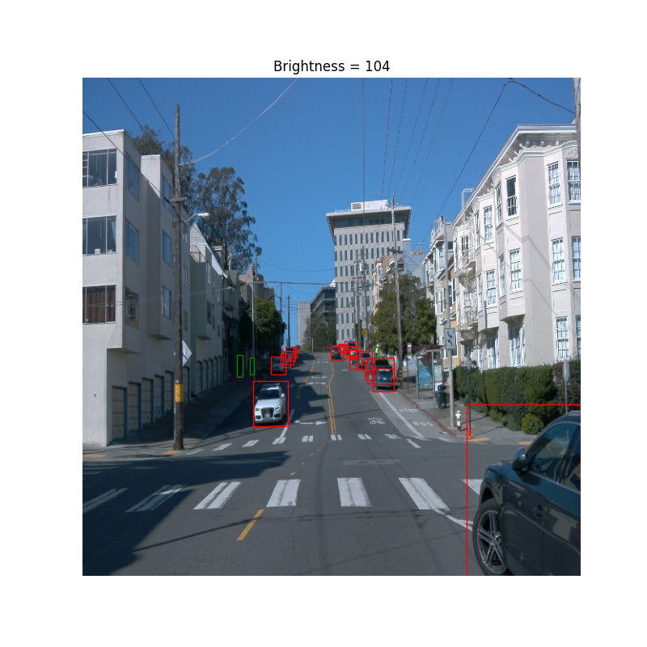

# Object Detection in an Urban Environment

## Project overview

Goal of the project is, to apply the skills gained in the computer vision course, which is part of the Self Driving Car Engineer Nanodegree program. Object detection is useful in autonomous vehicle as camera are relatively cheap sensor with a high resoluion, which allows detection of mupltiple object of different sizes.
A convolutional neural network will be used to detect and classify objects originating from [Waymo Open dataset](https://waymo.com/open/). Specifically, the classes of object shall be detected in image taken by the front camera of a vehicle: cyclists, pedestrians and vehicles.

In the first step, an exploratory data analysis will be performed to gain some knowlegde about the data set. Then a pretrained Resnet50 model will be trained on the training data, validated and hyperparameters tuned if needed.

## Structure

### Data

The data files can be downloaded directly from the Waymo website as tar files or from the [Google Cloud Bucket](https://console.cloud.google.com/storage/browser/waymo_open_dataset_v_1_2_0_individual_files/) as individual tf records.
The Udacity project workspace has been used for the project. The workspace has the data already readily available.

The data in the workspace was already partitioned into 3 splits:<br>
/home/workspace/home/data/train - 86 files<br>
/home/workspace/home/data/val - 10 files<br>
/home/workspace/home/data/test - 3 files<br>


### Experiments
The experiments folder will be organized as follow:
```
experiments/
    - pretrained_model/
    - exporter_main_v2.py - to create an inference model
    - model_main_tf2.py - to launch training
    - reference/ - reference training with the unchanged config file
    - experiment0/ - create a new folder for each experiment you run
    - experiment1/ - create a new folder for each experiment you run
    - experiment2/ - create a new folder for each experiment you run
    - label_map.pbtxt
    ...
```

## Prerequisites

Workspace has been used as provided, no changes where made. Udacity provided information about the requirments for running the scripts on a machine other than the workspace, those infos can be found in folder "build".

## Exploratory Data Analysis
### Preview of images
The following images are randomly picked from the data set. The image title is the brightness of the image, the intention is to get an idea how the brightness value maps to an image so the histogram in the following analysis can be interpreted.<br>
Object classes of the boundig boxes are color coded:
|Object class|Color|
|------------|-------|
|Vehicles|red|
|Pedestrian|green|
|Cyclists|blue|

||||
|:-------------------------:|:-------------------------:|:-------------------------:|
||||
||||

### Plan for further data analysis
The training and validation data set shall be compared.<br> 
The following stats shall be calculated for every frame in the datasets:
- Number of objects
- Number of vehicles
- Number of pedestrians
- Number of cyclist
- Brightness of image

### Histograms
#### Number of objects

#### Number of vehicles

#### Number of pedestrians

#### Number of cyclist

#### Brightness of image

### Summary
The trainung data set contains 1719 and the validation data set 198 individual pictures. According to the histogram plot as well as to the median in the descriptive statistics, the validation data set generally contains more objects per frame compared with the training data set.
In both data set, there are almost no cyclists. Most of the objects are vehicles.
The average image brightness is quite compareable in both data sets, though the validation set does not contain really dim images.


### Edit the config file

Now you are ready for training. As we explain during the course, the Tf Object Detection API relies on **config files**. The config that we will use for this project is `pipeline.config`, which is the config for a SSD Resnet 50 640x640 model. You can learn more about the Single Shot Detector [here](https://arxiv.org/pdf/1512.02325.pdf).

First, let's download the [pretrained model](http://download.tensorflow.org/models/object_detection/tf2/20200711/ssd_resnet50_v1_fpn_640x640_coco17_tpu-8.tar.gz) and move it to `/home/workspace/experiments/pretrained_model/`.

We need to edit the config files to change the location of the training and validation files, as well as the location of the label_map file, pretrained weights. We also need to adjust the batch size. To do so, run the following:
```
python edit_config.py --train_dir /home/workspace/data/train/ --eval_dir /home/workspace/data/val/ --batch_size 2 --checkpoint /home/workspace/experiments/pretrained_model/ssd_resnet50_v1_fpn_640x640_coco17_tpu-8/checkpoint/ckpt-0 --label_map /home/workspace/experiments/label_map.pbtxt
```
A new config file has been created, `pipeline_new.config`.

### Training

You will now launch your very first experiment with the Tensorflow object detection API. Move the `pipeline_new.config` to the `/home/workspace/experiments/reference` folder. Now launch the training process:
* a training process:
```
python experiments/model_main_tf2.py --model_dir=experiments/reference/ --pipeline_config_path=experiments/reference/pipeline_new.config
```
Once the training is finished, launch the evaluation process:
* an evaluation process:
```
python experiments/model_main_tf2.py --model_dir=experiments/reference/ --pipeline_config_path=experiments/reference/pipeline_new.config --checkpoint_dir=experiments/reference/
```

**Note**: Both processes will display some Tensorflow warnings, which can be ignored. You may have to kill the evaluation script manually using
`CTRL+C`.

To monitor the training, you can launch a tensorboard instance by running `python -m tensorboard.main --logdir experiments/reference/`. You will report your findings in the writeup.

### Improve the performances

Most likely, this initial experiment did not yield optimal results. However, you can make multiple changes to the config file to improve this model. One obvious change consists in improving the data augmentation strategy. The [`preprocessor.proto`](https://github.com/tensorflow/models/blob/master/research/object_detection/protos/preprocessor.proto) file contains the different data augmentation method available in the Tf Object Detection API. To help you visualize these augmentations, we are providing a notebook: `Explore augmentations.ipynb`. Using this notebook, try different data augmentation combinations and select the one you think is optimal for our dataset. Justify your choices in the writeup.

Keep in mind that the following are also available:
* experiment with the optimizer: type of optimizer, learning rate, scheduler etc
* experiment with the architecture. The Tf Object Detection API [model zoo](https://github.com/tensorflow/models/blob/master/research/object_detection/g3doc/tf2_detection_zoo.md) offers many architectures. Keep in mind that the `pipeline.config` file is unique for each architecture and you will have to edit it.

**Important:** If you are working on the workspace, your storage is limited. You may to delete the checkpoints files after each experiment. You should however keep the `tf.events` files located in the `train` and `eval` folder of your experiments. You can also keep the `saved_model` folder to create your videos.


### Creating an animation
#### Export the trained model
Modify the arguments of the following function to adjust it to your models:

```
python experiments/exporter_main_v2.py --input_type image_tensor --pipeline_config_path experiments/reference/pipeline_new.config --trained_checkpoint_dir experiments/reference/ --output_directory experiments/reference/exported/
```

This should create a new folder `experiments/reference/exported/saved_model`. You can read more about the Tensorflow SavedModel format [here](https://www.tensorflow.org/guide/saved_model).

Finally, you can create a video of your model's inferences for any tf record file. To do so, run the following command (modify it to your files):
```
python inference_video.py --labelmap_path label_map.pbtxt --model_path experiments/reference/exported/saved_model --tf_record_path /data/waymo/testing/segment-12200383401366682847_2552_140_2572_140_with_camera_labels.tfrecord --config_path experiments/reference/pipeline_new.config --output_path animation.gif
```

## Submission Template

### Project overview
This section should contain a brief description of the project and what we are trying to achieve. Why is object detection such an important component of self driving car systems?

### Set up
This section should contain a brief description of the steps to follow to run the code for this repository.

### Dataset
#### Dataset analysis
This section should contain a quantitative and qualitative description of the dataset. It should include images, charts and other visualizations.
#### Cross validation
This section should detail the cross validation strategy and justify your approach.

### Training
#### Reference experiment
This section should detail the results of the reference experiment. It should includes training metrics and a detailed explanation of the algorithm's performances.

#### Improve on the reference
This section should highlight the different strategies you adopted to improve your model. It should contain relevant figures and details of your findings.
